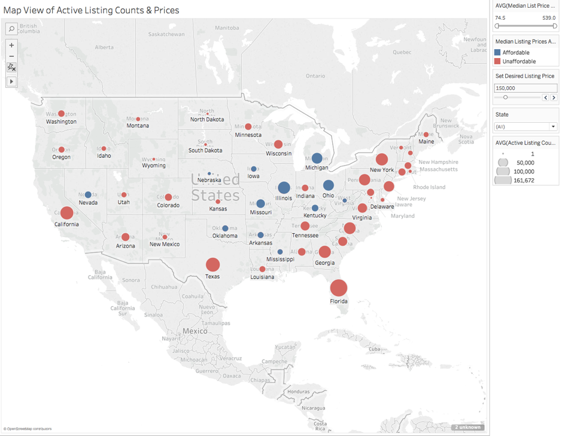
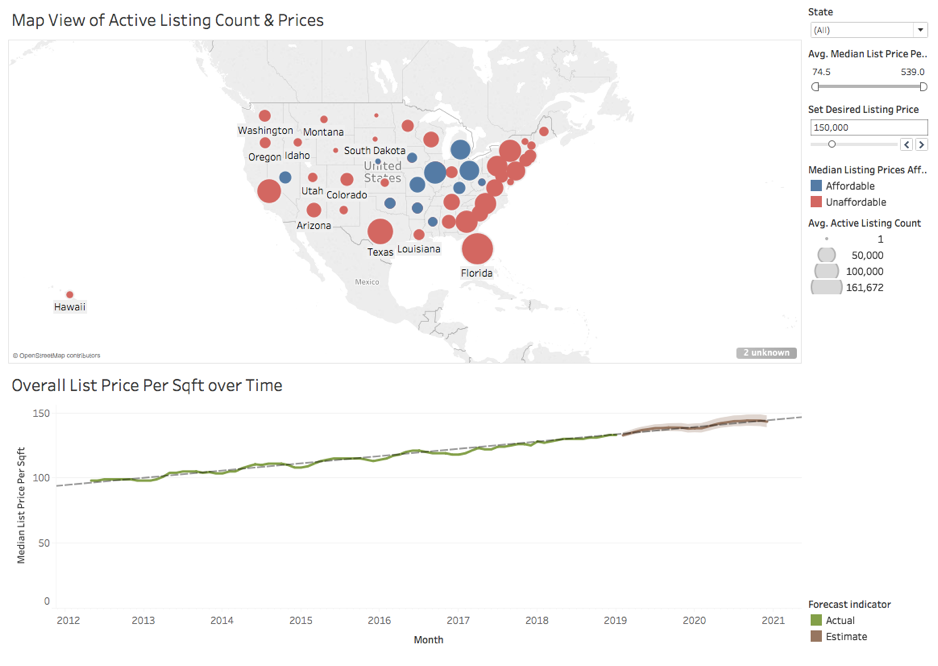
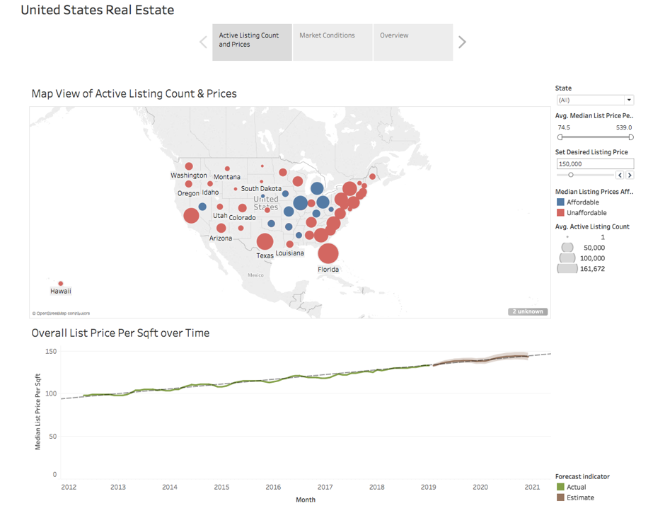
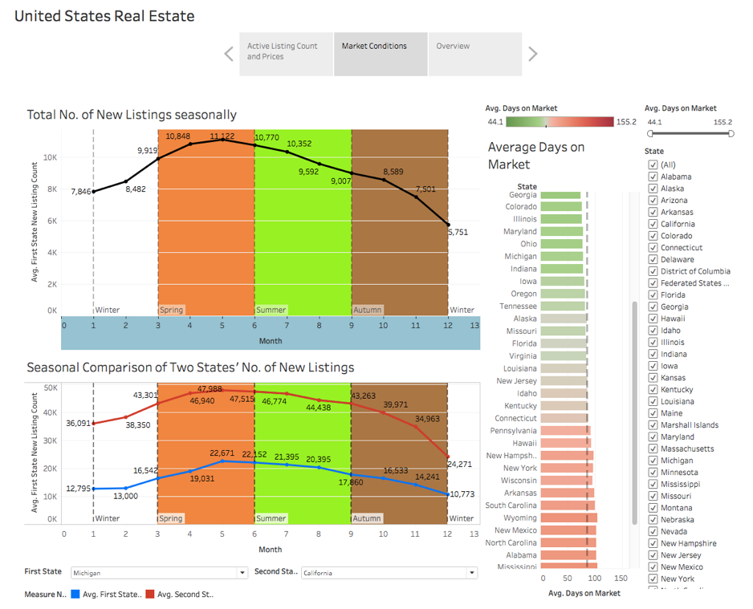
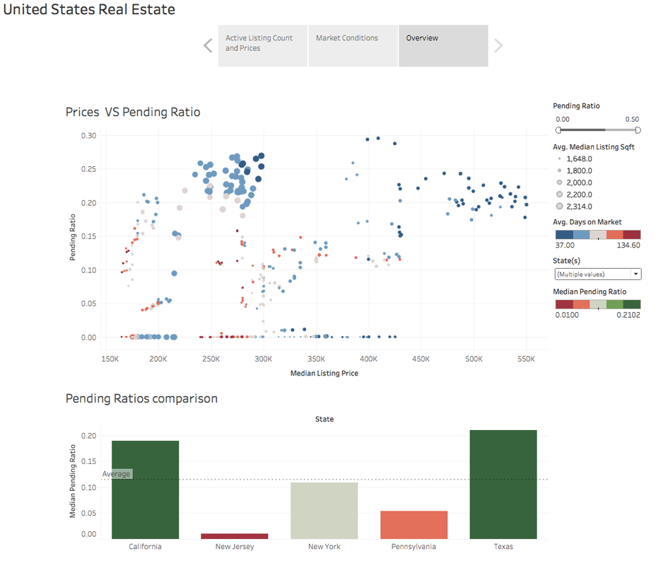

# real-estate-data
I built various data visualisation diagrams on US's Real Estate data using Tableau.

Click [here](https://public.tableau.com/views/US_RealEstate/UnitedStatesRealEstate?:display_count=y&:origin=viz_share_link) to play around with the data!

